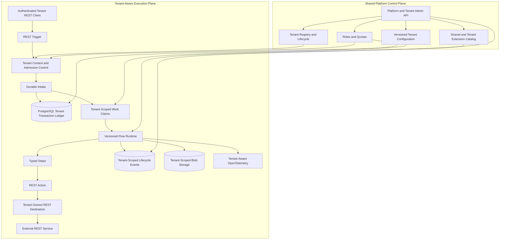

# Logplain Backend Architecture

Status: High-level design only. No implementation has started.

## System Overview

Logplain is a Java 26 integration runtime for many Tenants.

The runtime uses Spring Boot 4.1.x and Spring Framework 7.0.9 or newer. The project uses Maven 3.6.3 or newer as its build tool.

An authenticated REST request starts a `Transaction`. The runtime runs a versioned `Flow` for the Tenant. The Flow can call an external REST service through a Tenant-owned `RestDestination`.

The first release uses one modular monolith. A modular monolith is one deployed application with clear internal modules. The runtime has two logical areas:

- The shared platform control plane manages Tenants, roles, quotas, configuration, and Extensions.
- The Tenant execution plane receives requests and runs Flows.

Keep these areas separate in the design. The first deployment can still run them in one process. The runtime can split them later if needed.

## High-Level Design



## How a REST Request Moves Through the System

1. A Tenant client sends a REST request.
2. `RestTrigger` authenticates the request.
3. The runtime creates the `TenantContext`.
4. The runtime checks Tenant status, permissions, and quotas.
5. The runtime stores a `Transaction` and its first event.
6. A work claim starts the correct version of the `Flow`.
7. The `Flow` runs its `Step` objects.
8. A `RestAction` can call a Tenant-owned `RestDestination`.
9. The runtime stores status, events, telemetry, and audit records.

The runtime returns a response only after the request reaches the configured acceptance point. A short Flow can return its result. A long Flow returns `202 Accepted` and a transaction reference.

## Runtime Areas

### REST Adapters

REST has two separate capabilities:

- `RestTrigger` accepts an authenticated request for a Tenant `Endpoint`.
- `RestAction` calls an external REST service through a Tenant `RestDestination`.

`RestTrigger` handles HTTP authentication, request parsing, routing, response mode, and acceptance. It does not run business logic.

`RestAction` handles outbound HTTP authentication, timeout, retry, rate limits, response classification, correlation, and uncertain delivery. It can use only a destination that belongs to the current Tenant.

### Tenant Context and Request Checks

`TenantContext` contains the trusted Tenant identity and authorization scope for an operation.

The runtime creates it from an authenticated credential or a server-managed client binding. A Tenant ID in a URL, header, or request body is only a routing hint. The runtime rejects it when it does not match the authenticated Tenant.

Before the runtime accepts a request, it checks:

1. The Tenant lifecycle state.
2. Endpoint ownership and publication state.
3. Credential and permission scope.
4. Request rate, concurrency, queue depth, payload size, outbound calls, retention, and Extension runtime quotas.
5. Idempotency scope and delivery identity.

The runtime normally does not create a business Transaction for a request rejected by these checks. It can record the rejection when security or audit rules require it.

### Durable Intake

Durable intake stores the request before it reports acceptance.

It performs these steps:

1. Resolve the trusted `TenantContext`.
2. Find the Tenant `Endpoint` and its published Flow binding.
3. Find the exact Flow and Extension versions visible to the Tenant.
4. Check the idempotency key in this scope:

   ```text
   tenantId + endpointId + clientKey
   ```

5. Store the root `Transaction`, its first event, and a Tenant-scoped work item.
6. Return durable acceptance to `RestTrigger`.

Large request bodies and attachments go to the Tenant-scoped `BlobStore`. The Transaction stores references to those objects.

### Transaction and Application Services

Application services run the main use cases. They manage:

- Tenant lifecycle.
- Configuration publication.
- Transaction state changes.
- Step execution.
- Retry and wait rules.
- Quotas.
- Operator commands.
- Platform-wide operations.

These services do not depend on HTTP, Spring, or one database implementation.

### Flow Runtime

The Flow runtime loads the exact Flow version selected for the Transaction. It runs typed Steps.

Steps run in sequence by default. A Flow can use explicit fan-out and fan-in. These operations must define a limit, item identity, failure rule, and result rule.

When a Step must wait, the runtime stores a continuation and changes the Transaction to `WAITING`. A later event or command resumes the Flow. The runtime does not depend on an in-memory task surviving a restart.

### Extension SPI

The main Extension roles are:

- `RestTrigger`: accepts a REST request for an authorized Tenant `Endpoint`.
- `RestAction`: performs an outbound REST call for an authorized Tenant `RestDestination`.
- `Step<I, O>`: validates, transforms, or performs business work.
- `FlowDefinition`: composes Steps and declares Flow rules.

Each Extension has an `ExtensionVisibility` value:

- `PlatformShared`: the platform can make the Extension available to selected Tenants.
- `TenantSpecific(tenantId)`: the Extension is available only to one Tenant.

All Extensions are trusted and reviewed by the platform. The platform packages them into an immutable deployment. The runtime loads them at startup. Tenants cannot upload or hot-load arbitrary Java code in v1.

### Persistence and Object Storage

PostgreSQL stores:

- Tenants, lifecycle state, roles, quotas, and platform grants.
- Tenant-owned Endpoint and Flow binding versions.
- Tenant-owned `RestDestination` settings and policy references.
- Transaction status and current state.
- Ordered Transaction events.
- Step executions and Attempts.
- Tenant-scoped idempotency keys and delivery identities.
- Schedules, leases, work claims, retries, and operator commands.
- Outbox records, audit records, and object metadata.

Every Tenant-owned table has Tenant ownership. PostgreSQL row-level security adds a database check to the application checks.

S3-compatible object storage keeps large request bodies, attachments, and archived history. Every object key contains Tenant scope. Objects are immutable by reference, encrypted, access-controlled, and controlled by retention rules.

### Administration and Telemetry

The administration API manages Tenant lifecycle, roles, quotas, configuration, transaction search, and recovery actions.

Platform administrators can work across Tenants only when they use explicit platform scope. Tenant administrators, operators, and auditors are Tenant-scoped by default.

OpenTelemetry connects REST requests, Tenant context, Transactions, Steps, Attempts, outbound actions, and operator commands. Use globally unique transaction IDs and safe correlation IDs. Do not write raw payloads to logs by default.

## Canonical Domain Glossary

**Tenant**: A customer or organization that owns data, configuration, permissions, quotas, and Transactions.

**TenantContext**: The trusted Tenant identity and permission scope for an operation.

**Endpoint**: A Tenant-owned REST entry point that starts one published Flow version.

**RestTrigger**: The inbound REST capability that authenticates and accepts a request.

**RestAction**: The outbound REST capability that calls an approved `RestDestination`.

**RestDestination**: A Tenant-owned external REST target and its call rules.

**Flow**: A versioned set of business Steps.

**Message**: The stored request data and metadata passed into a Flow.

**Transaction**: The root execution created for one accepted REST request.

**Step**: One business operation inside a Flow.

**Attempt**: One run of a Step. A retry creates another Attempt.

**Extension**: A versioned Java artifact that adds a Trigger, Action, Step, or Flow.

**ExtensionVisibility**: The rule that says which Tenants can use an Extension.

**Schedule**: A future internal trigger that can create a Transaction.

**Quota**: A limit on a Tenant resource or operation.

## Core Domain Relationships

```text
Tenant ──owns──> Endpoint
Tenant ──owns──> RestDestination
Tenant ──owns──> Flow Binding
Endpoint ──binds to──> Published Flow Version
Endpoint ──receives──> Message
Message ──creates──> Root Transaction
Transaction ──contains──> Step Executions
Step Execution ──contains──> Attempts
Schedule ──creates──> Tenant-Scoped Transaction
Transaction ──records──> Tenant-Scoped Lifecycle Events
```

Each Endpoint has one active Flow binding in v1. Use separate Endpoints for separate routes. Do not hide routing rules inside configuration.

## REST Responses

Each Endpoint chooses `sync` or `async` completion:

- **Synchronous:** run the Flow within a hard time limit and return its result.
- **Asynchronous:** store the request and return `202 Accepted` with a globally unique transaction reference.

Only an authorized Tenant or an authorized platform operation can read a Transaction or change its state. A transaction reference cannot grant access to another Tenant.

A `RestDestination` stores its URL, method rules, secret reference, timeout, retry, rate-limit, response, correlation, and idempotency rules.

## Transaction Lifecycle

The public Transaction states are:

```text
ACCEPTED → RUNNING → WAITING → RUNNING
    │          │         │
    │          │         ├── SUCCEEDED
    │          │         ├── FAILED
    │          │         └── TIMED_OUT
    │          ├── SUCCEEDED
    │          ├── REJECTED
    │          ├── FAILED
    │          ├── DEAD_LETTERED
    │          ├── CANCELLED
    │          └── TIMED_OUT
    └── REJECTED
```

`RECEIVED` is an event, not a long-lived state. Each state change adds an event and updates the current status.

A retry creates another Attempt under the same Step and Transaction. It does not create a new business Transaction. The error category and Tenant, Endpoint, and Step policies decide if a retry is allowed.

Fan-out creates child executions. The root Transaction stays open until its result policy finishes. A partial result is valid only when the Flow allows it.

If an outbound call times out and the external service may have accepted it, the runtime records an uncertain Attempt. The Transaction stays in `WAITING` until policy or an authorized operator resolves it.

## Configuration Lifecycle

```text
Draft → Validated → Published → Retired
```

- A Draft belongs to a Tenant and is not active.
- Validation checks ownership, Endpoint settings, Extension visibility, schema compatibility, secret references, quotas, and Flow bindings.
- A Published version cannot change.
- Each Tenant Endpoint has one active published binding.
- A rollback publishes an older compatible version.
- A running Transaction keeps the versions selected when it was accepted.

## Tenant Lifecycle and Operations

```text
Provisioning → Active → Suspended → Retiring → Deleted
```

- `Provisioning`: the platform creates Tenant resources.
- `Active`: the Tenant can use the runtime within its quotas.
- `Suspended`: the runtime blocks new requests. Authorized recovery can still run.
- `Retiring`: the runtime blocks new configuration and requests while cleanup runs.
- `Deleted`: access is removed after controlled deletion and retention processing.

The runtime checks Tenant quotas before durable acceptance. Quotas cover request rate, concurrent Transactions, queue depth, payload size, outbound calls, retention, and Extension runtime.

## Planned Conceptual Module Structure

```text
logplain/
├── domain/
├── application/
├── tenant-management/
├── connector-spi/
├── flow-runtime/
├── persistence/
├── runtime-shell/
├── admin-api/
└── extensions/
```

- `domain`: Tenant, Endpoint, Destination, Transaction, state changes, events, policies, quotas, and errors.
- `application`: use cases, Tenant-aware orchestration ports, Transaction commands, request checks, and recovery actions.
- `tenant-management`: Tenant lifecycle, roles, quotas, Extension visibility, and platform operations.
- `connector-spi`: framework-neutral REST Trigger and REST Action contracts.
- `flow-runtime`: Flow composition, Step execution, waits, fan-out, compatibility, and Extension visibility checks.
- `persistence`: PostgreSQL repositories, row-level policies, work claims, current status, events, outbox, audit records, and object references.
- `runtime-shell`: Spring Boot 4.1.x startup, dependency wiring, REST hosting, security, Tenant context propagation, and health endpoints.
- `admin-api`: platform and Tenant administration, Transaction queries, and recovery commands.
- `extensions`: versioned shared and Tenant-specific Flows, Steps, and REST Actions.

## Security and Secrets

- Administration uses external identity and roles.
- Tenant REST callers use credentials bound to a Tenant and Endpoint.
- A request-supplied Tenant ID is never the source of authority.
- Endpoint and Destination settings store secret references, not secret values.
- A deployment-provided secret store resolves the references.
- Events, telemetry, and audit records remove sensitive headers, credentials, and payload data.
- Platform operations require platform scope and record the actor, reason, Tenant scope, and affected resources.

## Retention and Payload Storage

The runtime keeps Transaction status and events according to Tenant and Endpoint policy. It can archive older history as immutable records. Raw request bodies and attachments normally have shorter retention periods.

Each Tenant policy must define encryption, access, redaction, archive, and deletion rules. When the runtime deletes an expired payload, it keeps the Transaction history and records the deletion event.

## v1 Non-Goals

- Interpreted scripts or arbitrary source execution.
- Untrusted Tenant-uploaded code.
- Runtime hot-loading of Extensions.
- Full event sourcing.
- Dedicated broker infrastructure.
- Arbitrary asynchronous graphs.
- Exactly-once external side effects.
- Multi-region active-active operation.
- Visual flow authoring.
- Deferred protocol capabilities described in `LATER.md`.
